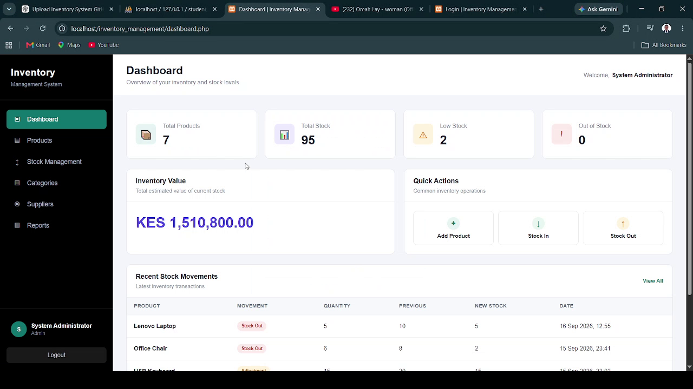

# Inventory Management System

A web-based Inventory Management System built with PHP, MySQL, HTML, CSS, and JavaScript. The system helps businesses manage products, suppliers, stock levels, categories, and inventory movements through a centralized dashboard.

## Featured Project

**Inventory Management System** — A full-stack PHP and MySQL application designed to simplify day-to-day inventory operations.

### Demo Video

[](https://drive.google.com/file/d/1vRjVCymCp1ILXllA1WRQviCcLBwLu2SK/view?usp=drive_link)

**Click the image above to watch the full system demonstration.**

## Features

* Secure user authentication
* Dashboard with inventory statistics
* Product management
* Add, edit, and delete products
* Category management
* Supplier management
* Stock management
* Stock movement tracking
* Low-stock monitoring
* Inventory reports
* Responsive user interface
* MySQL database integration
* Password hashing and verification

## Technologies Used

* **PHP**
* **MySQL**
* **HTML5**
* **CSS3**
* **JavaScript**
* **Apache/XAMPP**
* **Git & GitHub**

## Project Structure

```text
inventory-management-system/
│
├── config/
│   └── db.example.php
│
├── css/
│   └── style.css
│
├── includes/
│   └── header.php
│
├── js/
│   └── script.js
│
├── add_product.php
├── categories.php
├── dashboard.php
├── database.sql
├── delete_product.php
├── edit_product.php
├── index.php
├── login.php
├── logout.php
├── products.php
├── reports.php
├── stock_management.php
└── suppliers.php
```

## Database Setup

1. Install XAMPP and start **Apache** and **MySQL**.
2. Create a MySQL database named:

```text
inventory_db
```

3. Import `database.sql` into the database using phpMyAdmin.
4. Create your local database configuration from:

```text
config/db.example.php
```

5. Save the local configuration as:

```text
config/db.php
```

6. Update the database credentials in `config/db.php`.

The actual `config/db.php` file is excluded from GitHub for security.

## Running the Application

Place the project inside the XAMPP `htdocs` directory:

```text
C:\xampp\htdocs\inventory_management
```

Start Apache and MySQL from XAMPP, then open:

```text
http://localhost/inventory_management/
```

## Demo Account

The project includes a demo account configured through the sample database.

Use the demo credentials provided in `database.sql` after importing the database.

For security, do not use demo credentials as passwords for personal accounts or other services.

## Security

Sensitive local configuration files are excluded from the repository using `.gitignore`.

Excluded files include:

```text
config/db.php
.env
create_password.php
```

The repository contains only the example database configuration required for local setup.

## What I Built

This project demonstrates practical experience in:

* Full-stack web application development
* PHP backend development
* MySQL database design
* CRUD operations
* User authentication
* Session management
* Database relationships
* Inventory and stock management
* Form validation
* Responsive interface development
* Git and GitHub version control

## Developer

**Wilberforce Muhuyi**

Software Engineer | Full Stack Developer

* Portfolio: https://wilberforcedevportfolio.netlify.app/
* LinkedIn: https://www.linkedin.com/in/wilberforce-muhuyi-49762a39/
* Email: [wilberforcemuhuyi28@gmail.com](mailto:wilberforcemuhuyi28@gmail.com)
* WhatsApp: +254718682769

## License

This project is available for portfolio and educational purposes.
